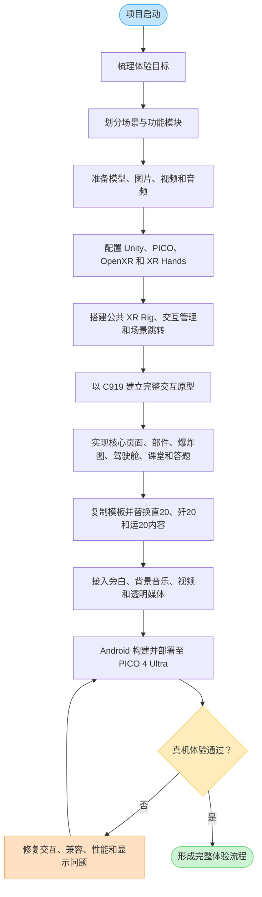
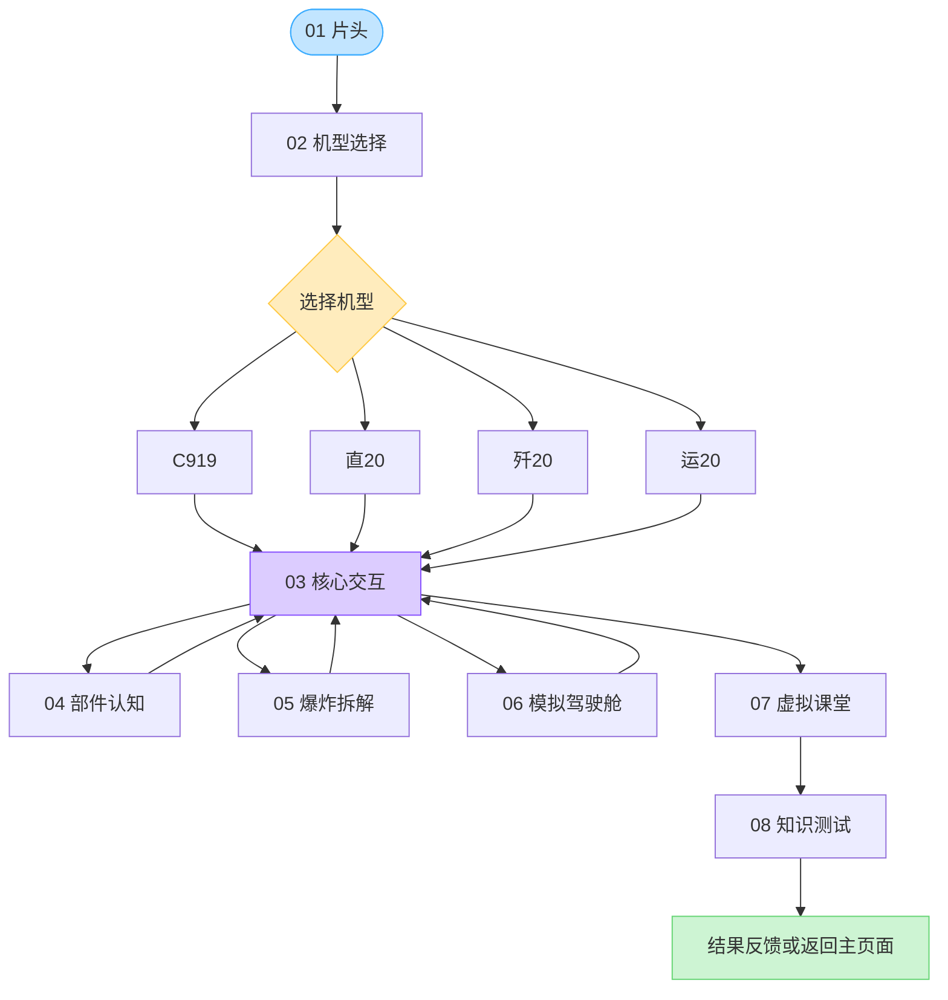
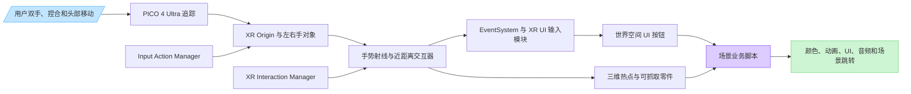
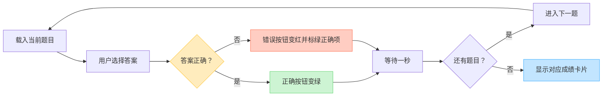
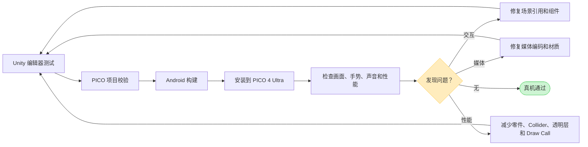

# 《翼揽无余》Unity MR 项目技术实现路径

> 项目类型：面向 PICO 4 Ultra 的航空科普 MR/VR 交互应用  
> 开发环境：Unity 2022.3.62f3c1  
> XR 环境：PICO Integration 3.4.0、XR Interaction Toolkit 2.6.4、XR Hands 1.8.0、OpenXR 1.14.3  
> 文档用途：项目汇报、技术说明、后续维护和多机型内容扩展

## 一、建议怎样呈现整个项目

这个项目不适合只画一张非常大的流程图。最佳呈现方式是：

1. **一张总体技术路线图**：说明项目从需求、资源、Unity 搭建到 PICO 真机验证的过程。
2. **一张用户体验流程图**：说明用户进入项目后依次能体验哪些内容。
3. **一张交互系统图**：说明手势、射线、UI、三维模型和业务脚本之间怎样连接。
4. **一张场景功能矩阵**：列出每个场景的功能、组件和脚本，方便答辩与维护。
5. **若干关键技术页**：重点讲解模型标注、爆炸图、驾驶舱、视频课堂和答题系统。

这样既能让非技术人员快速看懂，也能让开发人员根据文档重新找到 Unity 中的配置位置。

---

## 二、总体技术实现路线



这条路线的核心思路是：**先完成一套可运行的 C919 模板，再把稳定的交互结构复制到其他机型，只替换模型、文案、图片、视频、音频和题库数据。**

---

## 三、用户体验流程



目前工程已形成“两个公共场景＋四套机型场景”的结构：

- 公共场景负责片头和机型选择。
- 每个机型拥有独立的核心交互、部件、爆炸图、驾驶舱、课堂和答题场景。
- 场景均通过 Build Settings 中的场景名称或序号进行跳转。

---

## 四、Unity 交互系统连接关系



### 基础对象配置原则

- 每个运行场景只保留一个有效的 `EventSystem`。
- 每个运行场景只保留一个主要的 `XR Interaction Manager`。
- XR Rig 使用 PICO/XR Hands 的左右手追踪、射线和近距离交互器。
- 世界空间 Canvas 使用 XR 可识别的 UI 射线组件。
- UI 按钮依赖 `Button/Image` 的射线目标；三维对象依赖 `Collider` 和 XR Interactable。
- 场景中只能保留一个有效 `Audio Listener`，一般位于 XR 主摄像机。

---

## 五、场景功能与脚本矩阵

| 模块 | 用户看到的效果 | Unity 主要组成 | 主要脚本 |
|---|---|---|---|
| 01 片头 | 粒子背景、图片和视频交替、旁白、结束按钮 | Particle System、Image、RawImage、VideoPlayer、RenderTexture、AudioSource、CanvasGroup | `IntroSlideshowController.cs`、`IntroVideoClickToContinue.cs` |
| 02 机型选择 | 选择 C919、直20、歼20或运20 | 世界空间 Canvas、Button、场景跳转事件 | 按钮 OnClick 与场景加载逻辑 |
| 03 核心交互 | 旋转飞机、点击发光热点、展开标签并进入部件页面 | AircraftRotationRoot、AnnotationAnchors、Collider、XRSimpleInteractable、标签 Canvas | `TwoHandPinchLocalYawRotate.cs`、`AircraftAnnotationHotspot.cs`、`WorldSpaceBillboard.cs` |
| 04 部件认知 | 部件自动旋转、图文说明、视频或语音展示 | 3D 模型、Canvas、VideoPlayer、AudioSource | `FixedStepAutoRotate.cs`、`SimpleAutoRotate.cs`、`StreamingVideoPlayer.cs`、`SequentialAudioPlayer.cs` |
| 05 爆炸拆解 | 完整模型缩放触发拆解、爆炸动画、零件单独抓取、整体复位 | 完整模型根节点、爆炸模型根节点、XRGrabInteractable、Collider、Rigidbody | `AircraftDisassemblyController.cs`、`AircraftExplodedViewController.cs`、`AircraftPartInteractionBatchTool.cs` |
| 06 模拟驾驶舱 | 操纵杆、左右踏板、机舱姿态变化、操作提示与语音 | 驾驶舱模型、虚拟摇杆、踏板按钮、FlightMotionRoot、AudioSource | `CockpitFlightMotionController.cs`、`CockpitVirtualJoystick.cs`、`CockpitPedalButton.cs`、`CockpitOperationFeedback.cs` |
| 07 虚拟课堂 | 播放课程、切换上一课/下一课、封面和信息联动 | VideoPlayer、RenderTexture、课程封面、课程 UI 面板 | `ClassroomLessonController.cs`、`VideoGalleryController.cs` |
| 08 答题测试 | 图片题目、图片答案、答题反馈、自动下一题和分数结果 | QuestionPage、选项 Button、结果卡片、TMP、Image | `QuizController.cs`、`QuizSessionResult.cs`、`QuizResultSceneController.cs` |
| 公共保障 | 场景切换后保持输入正常、限制或恢复头部范围、透视启动 | XR Origin、Input Actions、PICO 透视配置 | `XRInputActionsSceneReloadGuard.cs`、`XRHeadPositionLimiter.cs`、`PicoPassthroughStartup.cs` |

---

## 六、各核心模块的 Unity 实现路径

### 6.1 片头混合媒体播放

层级建议：

```text
IntroRoot
├── AmbientParticles
├── MediaRoot（Canvas Group）
│   ├── ImageScreen
│   └── VideoScreen（Raw Image）
├── VideoPlayer
├── NarrationAudioSource
├── VideoAudioSource
└── EnterButton
```

实现逻辑：

1. 在 `IntroSlideshowController` 的播放列表中按顺序配置图片或视频。
2. 图片使用 `Image`，视频通过 `VideoPlayer → RenderTexture → RawImage` 显示。
3. 每项可配置独立旁白、最短显示时间和结束停留时间。
4. `CanvasGroup` 统一处理淡入淡出，避免图片和视频切换时突变。
5. 全部内容完成后显示进入按钮，并跳转到机型选择页。
6. PICO 上优先使用兼容 Android 硬件解码的 H.264/AAC MP4；透明视频则使用上下或左右打包 Alpha 的视频与专用 Shader 解码。

透明视频相关 Shader：

- `Assets/公用文件/Shaders/AlphaPackedVideoUI.shader`

### 6.2 飞机旋转、热点和标签

层级建议：

```text
AircraftSystem
└── AircraftRotationRoot
    ├── AircraftModel
    └── AnnotationAnchors
        ├── Anchor_Nose
        │   ├── HotspotSphere
        │   └── LabelCanvas
        ├── Anchor_Engine
        ├── Anchor_Wing
        └── Anchor_Tail
```

实现逻辑：

1. 飞机模型、锚点和标签统一放在 `AircraftRotationRoot` 下。
2. 双手捏合后由 `TwoHandPinchLocalYawRotate` 读取两只手的位置角度，并只改变模型根节点的局部 Y 轴旋转。
3. 因锚点是旋转根节点的子物体，飞机转动时热点与标签自动跟随。
4. 热点使用球形 Collider 和 `XRSimpleInteractable` 接收手势射线选择。
5. `AircraftAnnotationHotspot` 控制标签展开与关闭，并可在标签打开或飞机旋转时临时阻止误触。
6. `WorldSpaceBillboard` 可让标签保持朝向用户，但不改变它与飞机部位之间的位置关系。

### 6.3 部件展示

1. 部件模型放入独立旋转根节点，修正模型轴心后再运行旋转脚本。
2. 简单连续旋转使用 `SimpleAutoRotate`。
3. 定角度、定时长的展示使用 `FixedStepAutoRotate`。
4. 文字、指引线和说明 UI 与模型保持合理空间距离，避免被模型遮挡。
5. 单面模型从切口观察为空时，可使用切面盖板，或使用项目中的双面材质 Shader：
   - `Assets/翼揽无余/Shaders/DoubleSidedStandard.shader`
   - `Assets/翼揽无余/Shaders/DoubleSidedTransparent.shader`

### 6.4 爆炸图与零件交互

推荐层级：

```text
AircraftInteractionRoot
├── CompleteAircraftRoot
├── ExplodedPartsRoot
│   ├── Part_001
│   ├── Part_002
│   └── ...
├── DisassembleButton
├── ResetButton
└── TransitionFlash
```

实现逻辑：

1. 初始只显示完整飞机，隐藏已经拆开的模型。
2. 用户将完整飞机放大到阈值，或点击“拆解”按钮，二者都调用 `TriggerDisassembly()`。
3. 完整模型淡出或缩放隐藏，爆炸模型由压缩状态运动到预设拆解位置。
4. 动画使用带回弹感的缓动参数，减少模型瞬间替换的生硬感。
5. 爆炸完成后，每个有效零件拥有 Collider、Rigidbody 和 `XRGrabInteractable`，支持单独抓取、移动、旋转和双手缩放。
6. `AircraftPartInteractionBatchTool` 用于批量给大量零件配置交互组件，避免逐个手工操作。
7. 点击复位后，零件回到缓存的局部位置和姿态，再切回完整飞机。
8. 完整飞机的整体交互与各零件的单独交互不能同时占用同一批 Collider，否则会产生重复注册警告和点击冲突。

### 6.5 模拟驾驶舱

推荐层级：

```text
FlightMotionRoot
├── CockpitModel
├── XR Origin
├── OutsideWorldRoot
├── VirtualJoystick
├── LeftPedal
├── RightPedal
└── OperationFeedbackRoot
```

控制映射：

| 用户操作 | 模拟反馈 |
|---|---|
| 踩左踏板 | 飞机向左偏航 |
| 踩右踏板 | 飞机向右偏航 |
| 向前推杆 | 飞机低头，准备下降 |
| 向后拉杆 | 飞机抬头，准备爬升 |
| 向左压杆 | 飞机左滚转 |
| 向右压杆 | 飞机右滚转 |

实现逻辑：

1. `CockpitVirtualJoystick` 把 UI 拖动量转换成二维操纵杆输入，并在松手后回中。
2. `CockpitPedalButton` 在按下和松开时输出左/右踏板状态。
3. `CockpitFlightMotionController` 将输入转换成 Pitch、Roll、Yaw，并对 `FlightMotionRoot` 做平滑姿态变化。
4. `CockpitOperationFeedback` 根据六种操作播放对应语音，并显示匹配的 UI 提示面板。
5. 音频源和提示 UI 应放在随驾驶舱或 XR Origin 一起运动的根节点下，避免飞行后声音距离变远。
6. 天空球主要提供远景，可叠加低面数云层、云片或缓慢移动的环境层增加飞行感。

### 6.6 虚拟课堂

课堂分为两类：

- **顺序课程模式**：上一课、下一课控制课程数组，封面、视频和课程信息面板同步切换。
- **视频图库模式**：六张缩略图共用一个视频播放器，点击不同图片时给同一个 `VideoPlayer` 替换不同 `VideoClip`；关闭后回到图库页。

关键点：

1. `lessonClips`、`lessonCovers`、`lessonUiPanels` 的数组顺序和长度必须对应。
2. 第一课禁用上一课按钮，最后一课禁用下一课按钮。
3. 播放时隐藏封面和播放按钮；停止或切换时恢复新课程封面。
4. 视频声音使用 `VideoPlayer` 的 Audio Source 输出到指定 `AudioSource`。
5. PICO 真机播放前需要验证视频不是空文件，并使用 Android 支持的编码格式。

### 6.7 答题系统

数据结构：

- 题库：`QuizQuestion[]`
- 每题内容：题目文本或题目图片
- 答案内容：选项文本或选项图片
- 正确答案：`Correct Option Index`
- 运行状态：当前题号、已答数量、正确数量

答题流程：



结果卡片按正确数索引：0 分使用数组元素 0，8 分使用数组元素 8。重新挑战时重置题号和分数，返回按钮跳回课堂或主页面。

---

## 七、多机型复用策略

项目先完成 C919 全流程，再扩展到直20、歼20和运20。合理的复制方式是把“结构”和“内容”分开：

### 可复用结构

- XR Interaction Hands Setup
- Input Action Manager
- XR Interaction Manager
- EventSystem
- 世界空间 Canvas 的交互组件
- 页面布局、返回按钮和导航按钮
- 课堂播放器、答题逻辑、音频管理器
- 驾驶舱输入脚本和操作反馈脚本

### 每个机型需要替换的内容

- 完整模型、部件模型和爆炸模型
- 模型缩放、位置、轴心和 Collider
- 热点锚点位置及标签文案
- 部件页面内容
- 驾驶舱贴图或模型
- 视频、封面、旁白和背景音乐
- 题目图片、选项图片和正确答案
- 场景跳转目标

推荐把稳定的公共对象制作成 Prefab，把每个机型的差异数据放在 Inspector 数组或后续的 ScriptableObject 中。这样复制新机型时不会重复修改交互底层。

---

## 八、媒体与声音实现原则

### 音频

- 背景音乐：单独 AudioSource，勾选循环，2D 空间混合。
- 场景旁白：单独 AudioSource，按进入场景、图片切换或操作事件触发。
- 视频声音：由 VideoPlayer 输出到专用 AudioSource。
- 操作提示：由事件触发播放，同一时刻只显示和播放当前操作反馈。
- 同场景存在多种声音时，不建议把全部内容预先合成一条音频，否则后续修改节奏和交互会很困难。

### 视频

- 普通视频：H.264 MP4＋AAC，RenderTexture 输出。
- UI 显示：VideoPlayer → RenderTexture → RawImage。
- 透明视频：Android/PICO 对带 Alpha 的常规视频兼容性有限，采用 RGB 与 Alpha 打包到同一视频画面，再由自定义 Shader 重建透明度更稳定。
- 视频清晰度不仅取决于 1920×1080，还取决于码率、RenderTexture 尺寸、UI 实际显示尺寸、纹理过滤和 PICO 渲染分辨率。

---

## 九、PICO 真机验证闭环



### 每次构建前检查

- Build Settings 场景已加入且顺序正确。
- Android 平台启用了正确的 PICO/OpenXR 功能。
- Hand Tracking 功能处于启用状态。
- 场景内只有一个主要 XR Origin、XR Interaction Manager、EventSystem 和 Audio Listener。
- Input Actions 已启用，左右手射线和捏合选择动作已绑定。
- 世界空间 Canvas 能被 XR 射线命中。
- 所有视频文件非空，编码能被 Android 解码。
- 所有 AudioSource 未静音，音量和 2D/3D 空间混合符合用途。
- 场景名称与脚本跳转名称完全一致。

---

## 十、开发过程中解决的典型问题

| 问题 | 原因 | 处理方式 |
|---|---|---|
| Unity 内可点击，PICO 内不可点击 | 手势射线、选择动作、UI 输入模块或 Collider 配置不完整 | 统一 XR Rig，核对 Ray Interactor、Select Action、XR UI Input Module 和 Tracked Device Graphic Raycaster |
| 射线很短或只在目标附近出现 | 射线视觉长度受到命中距离、Line Visual 或交互层影响 | 核对最大射线距离、Line Visual、交互层和遮挡 Collider |
| 删除 EventSystem 后完全不能点击 | 保留的 EventSystem 不含正确 XR UI 输入模块 | 保留唯一且配置正确的 EventSystem，而不是简单删除任意一个 |
| 多个 XR Interaction Manager 警告 | 场景模板和 XR Rig 各自带有管理器 | 统一为一个管理器并让交互器、交互物注册到同一管理器 |
| Hand Tracking Subsystem 未运行 | PC 编辑器没有设备子系统，或 Android OpenXR 手追踪未启用 | 编辑器警告与真机配置分开判断，并在 Android OpenXR/PICO 设置启用手追踪 |
| 粒子在 PICO 中不明显 | 粒子尺寸、材质、渲染层、黑色背景对比和 XR 分辨率共同影响 | 使用移动端友好透明材质，增加空间深度、亮度和近中远层次 |
| 视频有声音无画面 | RenderTexture、RawImage、视频编码或首帧准备问题 | 检查 Target Texture、RawImage Texture、Prepare 完成状态和 Android 编码 |
| 透明视频显示灰底或黑框 | MP4 本身没有可直接使用的 Alpha，PICO 解码器不支持当前透明格式 | 使用 Alpha 打包视频和 `AlphaPackedVideoUI` Shader |
| 模型内壁消失 | 单面模型与背面剔除 | 增加切面盖板、双面 Shader，或在建模软件中实体化内壁 |
| 爆炸图交互警告 | 整体交互和零件交互重复注册同一 Collider | 完整状态与拆解状态分开启用交互组件，确保 Collider 归属唯一 |
| 爆炸图真机卡顿 | 大量网格、材质、透明面、Collider、Rigidbody、XRGrabInteractable 同时运行 | 合并非交互零件、简化 Collider、分批启用交互、关闭不需要的阴影与实时脚本 |
| 场景黑屏或无法加载 | 相机、XR Origin、场景构建列表或初始化对象不完整 | 核对 Build Settings、主相机、XR Rig 和场景初始化日志 |
| 中文文字异常 | TMP 字体图集缺字、材质不匹配或分辨率不足 | 建立包含中文字符的 TMP Font Asset，使用合适 Atlas 尺寸和回退字体 |

---

## 十一、性能优化重点

PICO 4 Ultra 是移动端 XR 设备，优化重点按影响程度排列：

1. **爆炸图零件数量**：大量独立 Renderer、Collider、Rigidbody 和 XR Interactable 是最明显的 CPU/GPU 压力来源。
2. **只在需要时启用交互**：完整状态关闭零件交互，拆解完成后再启用；隐藏页面停止 Update、视频和音频。
3. **Collider 简化**：优先 Box/Sphere/Capsule Collider，避免大量 Mesh Collider。
4. **材质与 Draw Call**：相同零件尽量共享材质，减少透明材质和材质实例。
5. **阴影与灯光**：移动端减少实时阴影和额外灯光，优先烘焙或简单主光。
6. **视频和 RenderTexture**：尺寸满足实际观看即可，避免所有视频长期保持高分辨率纹理。
7. **UI 重绘**：减少频繁变化的大型世界空间 Canvas，把静态与动态 UI 分开。
8. **真机性能判断**：以 PICO 上的帧率和卡顿为准，编辑器流畅不代表 Android 设备流畅。

---

## 十二、主要工程文件索引

### 公共场景

- `Assets/公用文件/01_片头.unity`
- `Assets/公用文件/02-机型选择页面共用.unity`

### 四套机型场景

- `Assets/翼揽无余/Scenes翼揽无余/c919场景`
- `Assets/翼揽无余/Scenes翼揽无余/直20场景`
- `Assets/翼揽无余/Scenes翼揽无余/歼20场景`
- `Assets/翼揽无余/Scenes翼揽无余/运20场景`

### 运行脚本

- `Assets/翼揽无余/Scripts`

### 编辑器批处理工具

- `Assets/翼揽无余/Editor/AircraftInteractionSetupEditor.cs`
- `Assets/翼揽无余/Editor/AircraftPartInteractionBatchTool.cs`

### 自定义 Shader

- `Assets/公用文件/Shaders/AlphaPackedVideoUI.shader`
- `Assets/翼揽无余/Shaders/DoubleSidedStandard.shader`
- `Assets/翼揽无余/Shaders/DoubleSidedTransparent.shader`

---

## 十三、用于汇报时的推荐页序

如果需要把本技术路径制作成答辩 PPT，建议采用以下 10 页：

1. 项目目标与目标设备
2. 总体技术实现路线图
3. 用户体验与场景流程图
4. Unity XR 交互系统架构
5. 核心飞机交互与部件标注
6. 爆炸拆解与批量零件交互
7. 模拟驾驶舱输入与反馈
8. 视频课堂、音频和答题系统
9. 四机型模板复用策略
10. PICO 真机测试、问题修复与最终成果

项目技术主线可概括为：

> **以 PICO 手势交互为入口，以可复用场景模板为骨架，把三维模型、空间 UI、视频音频和知识测评组合成四类航空器的完整沉浸式学习流程，并通过持续真机测试完成交互兼容和移动端性能优化。**
